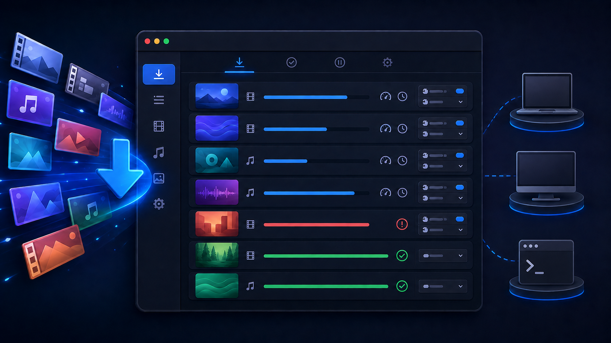

[English](README.md) | [Русский](README.ru.md) | [简体中文](README.zh-CN.md)

# JiveFetch

JiveFetch is a local-first desktop application for managing lawful media downloads.
It runs on macOS, Windows, and Linux and uses locally installed `yt-dlp` and FFmpeg.

## What you get

- Persistent queue with concurrent downloads and a global speed limit.
- Live progress, speed, ETA, downloaded size, and total size.
- Selection from the video formats actually available at the source; maximum quality
  is the default.
- Start, Pause, Stop, Retry, Remove, and Copy URL actions.
- Optional authentication with cookies from a selected browser.
- Configurable download folder and system, light, or dark theme.
- English, Russian, and Simplified Chinese interface; English is the first-run default.

## How to get it

Install both `yt-dlp` and FFmpeg, then download JiveFetch for your platform:

- macOS: Apple Silicon (`arm64`) DMG.
- Windows: 64-bit (`x64`) EXE or MSI.
- Linux: 64-bit (`x86_64`/`amd64`) AppImage or DEB.

- [Installation guide for macOS, Windows, and Linux](INSTALL.md)
- [Latest release and downloads](https://github.com/shurrman/jivefetch/releases/latest)
- [Additional steps for the current unsigned macOS build](docs/macos-installation.md)
